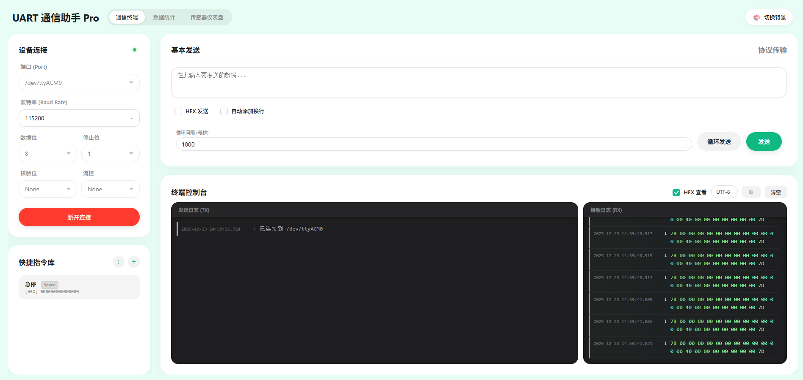
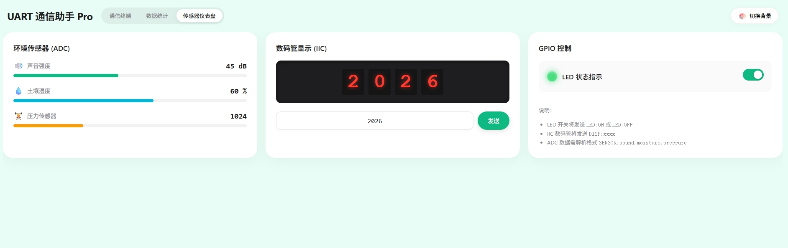

# UART Assistant Pro

<div align="center">


**A Minimalist, Cool, and Powerful Web-Based Serial Debugging Tool**

[English](README_EN.md) | [简体中文](README.md)

</div>

---

## ✨ Introduction

**UART Assistant Pro** is a cross-platform serial debugging tool built with Python (aiohttp) and modern Web technologies. It combines all the functionalities of a traditional serial assistant with a modernized UI design, real-time data visualization, a protocol builder, and a sensor dashboard specifically designed for IoT development.

Whether for embedded development, hardware debugging, or IoT teaching demonstrations, it provides an exceptionally smooth experience.

## 🚀 Key Features

### 🎨 Modern UI/UX
*   **Extreme Aesthetics**: Uses the Apple San Francisco font stack with frosted glass effects and smooth animations, offering a native app-like visual experience.
*   **Multi-Theme Support**: Built-in 12 exquisite color schemes including Apple Gray, Sakura, Mint, Ocean, etc., switchable at will.
*   **Responsive Layout**: Perfectly adapts to various screen sizes, supporting split-view layouts.

### 🔌 Powerful Serial Communication
*   **Full Parameter Configuration**: Supports Baud Rate, Data Bits (5-8), Stop Bits (1/1.5/2), Parity (None/Odd/Even/Mark/Space), and Flow Control (RTS/CTS, XON/XOFF).
*   **Multi-Encoding Support**: Real-time switching between UTF-8, GBK, ASCII, and Latin-1 encodings, eliminating garbled text issues.
*   **Smart Packet Splitting**: Supports custom Frame Header/Tail splitting for HEX data packets, making data streams clear at a glance.

### 🛠 Professional Debugging Tools
*   **Protocol Builder**: Built-in TX builder that automatically calculates checksums (SUM/XOR/CRC8) and supports custom headers, function codes, and sequence numbers.
*   **Quick Command Library**: Supports adding, editing, importing/exporting frequently used commands, with keyboard shortcut bindings (F1-F12).
*   **Loop Sending**: Supports automatic loop sending with millisecond-level precision.

### 📊 Data Visualization
*   **Real-time Statistics**: Monitors RX/TX bytes, packet counts, and transmission rates in real-time.
*   **Traffic Charts**: Built-in Chart.js powered real-time traffic distribution doughnut chart.
*   **IoT Dashboard**: A sensor dashboard designed for demonstrations, supporting:
    *   **ADC Sensors**: Dynamic progress bars for Sound, Moisture, Pressure, etc.
    *   **IIC Display**: Simulates real 7-segment display effects.
    *   **GPIO Control**: Interactive LED switch with status feedback indicator.

### 📝 Smart Logging System
*   **Cool Log View**: Geek-style log printing, distinguishing between RX/TX/System/Error message types.
*   **Bi-directional Sync**: System and error messages are synchronized to both TX and RX windows, ensuring no key status is missed.
*   **Precise Timestamping**: Millisecond-level timestamps, perfectly aligned.

## 📸 Screenshots

### Terminal
> Minimalist left-right split design: configuration and quick commands on the left, logs and send controls on the right.



### Statistics
> Real-time monitoring of communication traffic and rates.


### IoT Dashboard
> Interactive sensor data visualization panel.


## 🛠 Installation & Run

### Requirements
*   Python 3.8+
*   Modern Browser (Chrome, Edge, Firefox, Safari)

### 1. Clone Repository
```bash
git clone https://github.com/yourusername/uart-assistant-pro.git
cd uart-assistant-pro
```

### 2. Install Dependencies
```bash
pip install -r requirements.txt
```
> *If requirements.txt is missing, please install:*
> `pip install aiohttp pyserial`

### 3. Run Application
```bash
python app.py
```

### 4. Access Application
Open your browser and visit:
`http://localhost:8080` (Default port)

## 📖 Usage Guide

1.  **Connect Device**: Select the serial port on the left (supports auto-refresh), configure baud rate, etc., and click "Connect".
2.  **Send Data**:
    *   **Basic Send**: Input content in the right text area, supports HEX sending and auto-newline.
    *   **Protocol Send**: Switch to the "Protocol" tab, configure address, function code, and data to automatically generate protocol frames with checksums.
3.  **View Data**:
    *   **HEX View**: Check "HEX View" in the top right.
    *   **Packet Split**: Click the ⚙️ icon to set Frame Header/Tail (e.g., `7B` ... `7D`) for automatic split display.
4.  **Dashboard Demo**:
    *   Send data in `SENSOR:45,60,1024` format to update ADC charts.
    *   Send `LED:ON` or `LED:OFF` to control the switch status.

## 🤝 Contributing

Issues and Pull Requests are welcome! Feel free to share your ideas.

## 📄 License

This project is licensed under the MIT License. See the [LICENSE](LICENSE) file for details.
